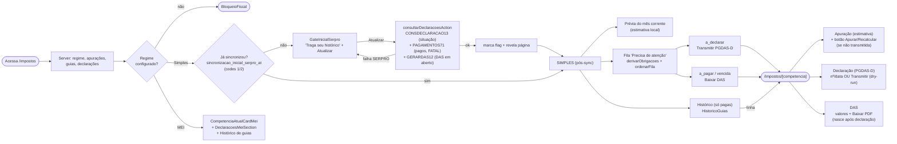

# Fluxo: Página /impostos

> Redesenho 2026-06-08: a /impostos (Simples) virou **fila de obrigações por estado** + **detalhe
> por competência**. Botões que disparam SERPRO por clique foram removidos (consumo cobrado) — o
> único sync é o gate inicial; refresh recorrente vira cron. Ver
> `docs/superpowers/specs/2026-06-08-impostos-fila-obrigacoes-design.md`.

## Estados da fila (helper `lib/fiscal/obrigacoes.ts`)

| Estado | Quando | Ação |
|---|---|---|
| `a_declarar` | mês fechado e sem declaração (ex.: maio) | Transmitir PGDAS-D (dry-run até a Fase 2) |
| `a_pagar` | declarada, não paga, vencimento ≥ hoje | Baixar DAS (PDF no detalhe) |
| `vencida` | não paga, vencimento < hoje | Baixar DAS (PDF no detalhe) |
| `paga` | status paga / `data_pagamento` | vai pro Histórico (não na fila) |

Mês corrente fica **fora da fila** (não fechou) → só na prévia. O detalhe do mês corrente mostra só Apuração.

## Arquivos envolvidos

| Arquivo | Papel |
|---|---|
| `app/(auth)/impostos/page.tsx` | Server — carrega dados, deriva obrigações (Simples), separa atenção × paga; gate; branch Simples/MEI |
| `app/(auth)/impostos/GateInicialSerpro.tsx` | Card do 1º sync (Simples sem `sincronizacao_inicial_serpro_at`) |
| `app/(auth)/impostos/actions.ts` | `consultarDeclaracoesAction` (CONSDECLARACAO13 + PAGAMENTOS71 fatal + GERARDAS12, casa por numero_das); `marcarSincronizacaoInicialAction`; `iniciarApuracaoAction` |
| `lib/fiscal/obrigacoes.ts` | helper puro: `derivarObrigacoes`, `ordenarFila`, `competenciasEsperadasDoAno` |
| `app/(auth)/impostos/PreviaMesCorrente.tsx` | prévia discreta do mês corrente |
| `app/(auth)/impostos/FilaObrigacoes.tsx` + `ObrigacaoItem.tsx` | fila de obrigações em atenção |
| `app/(auth)/impostos/HistoricoGuias.tsx` | tabela das pagas (linha expansível com detalhe do DAS) |
| `app/(auth)/impostos/[competencia]/page.tsx` | detalhe por competência |
| `app/(auth)/impostos/SecaoApuracao.tsx` | apuração + botão Apurar/Recalcular (não transmitidas) |
| `app/(auth)/impostos/SecaoDeclaracao.tsx` | declaração ou Transmitir (dry-run) |
| `app/(auth)/impostos/SecaoDas.tsx` | DAS + Baixar PDF (`GuiaActions`) |
| `app/(auth)/impostos/ApurarButton.tsx` | client: `iniciarApuracaoAction('commit')` — cálculo interno, idempotente |
| `app/(auth)/impostos/CompetenciaAtualCardMei.tsx` | card da competência atual (MEI) |
| `app/(auth)/impostos/mappers.ts` | linhas do banco → row types (compartilhado page/detalhe) |

> Removidos no redesenho: `CompetenciaAtualCard`, `GerarDasButton`, `GerarDasSimplesButton`,
> `ConsultarSerproButton` (e o "Marcar paga"/"Copiar linha" do `GuiaActions`). `DeclaracoesSection`
> ficou órfão (só o tipo `DeclaracaoRow` é usado).
