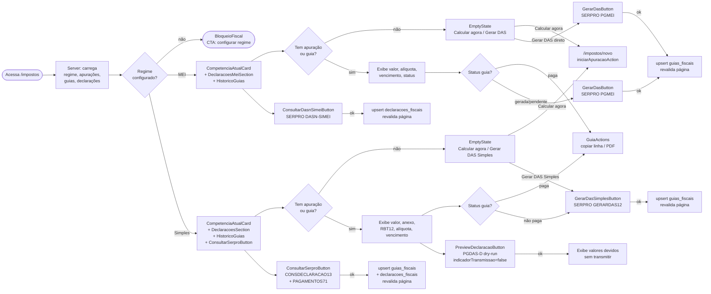

# Fluxo: Página /impostos

## Arquivos envolvidos

| Arquivo | Papel |
|---|---|
| `app/(auth)/impostos/page.tsx` | Server component — carrega regime, apurações, guias, declarações |
| `app/(auth)/impostos/actions.ts` | Todas as server actions da página |
| `app/(auth)/impostos/CompetenciaAtualCard.tsx` | Card do mês atual com empty state e botões de ação |
| `app/(auth)/impostos/GerarDasButton.tsx` | Gera DAS MEI via SERPRO PGMEI |
| `app/(auth)/impostos/GerarDasSimplesButton.tsx` | Gera DAS Simples via SERPRO GERARDAS12 |
| `app/(auth)/impostos/PreviewDeclaracaoButton.tsx` | Dry-run PGDAS-D (indicadorTransmissao=false) |
| `app/(auth)/impostos/ConsultarSerproButton.tsx` | Consulta CONSDECLARACAO13 + PAGAMENTOS71 |
| `app/(auth)/impostos/ConsultarDasnSimeiButton.tsx` | Consulta DASN-SIMEI (histórico MEI) |
| `app/(auth)/impostos/GuiaActions.tsx` | Copiar linha digitável / abrir PDF |
| `app/(auth)/impostos/HistoricoGuias.tsx` | Tabela de guias anteriores |
| `app/(auth)/impostos/DeclaracoesSection.tsx` | Tabela PGDAS-D (Simples) |
| `app/(auth)/impostos/DeclaracoesMeiSection.tsx` | Tabela DASN-SIMEI (MEI) |
